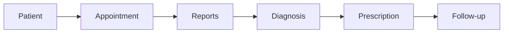

# 💊 Healix – Smart Hospital Management System

<p align="center">
  <b>A Modern Full-Stack Platform for Efficient Clinical Workflow</b><br>
  <i>Built for Doctors • Designed for Real-World Use</i>
</p>

---

## 🚀 Live Features Preview

✨ Real-time Dashboard
📅 Smart Appointment System
📄 Medical Reports Management
💊 Digital Prescriptions
⏰ Doctor Scheduling
🚨 Emergency Alerts

---

## 🧠 System Workflow



---

## 🖥️ Modules Overview

### 👨‍⚕️ Doctor Dashboard

* Live stats (patients, appointments, emergencies)
* Activity tracking
* Clean dark UI

---

### 👤 Patient Management

* Add / Edit / Delete patients
* View full medical history
* Track condition (Stable / Critical)

---

### 📅 Appointment System

* Timeline-based schedule
* Status tracking (Waiting / Ongoing / Completed)
* Quick consultation actions

---

### 📄 Reports

* Upload & view reports (PDF/Image)
* Filter: Critical / Recent / Pending
* Linked with patients

---

### 💊 Prescriptions

* Create prescriptions dynamically
* Add medicines, dosage, duration
* View history

---

### ⏰ Schedule

* Weekly availability
* Auto-generated time slots
* Block time / Leave system

---

### 🚨 Emergency Alerts

* Active emergency cases
* Priority-based system
* Quick response actions

---

## ⚙️ Tech Stack

| Layer    | Technology               |
| -------- | ------------------------ |
| Frontend | HTML, CSS, JavaScript    |
| Backend  | Node.js / Java (Servlet) |
| Database | MySQL                    |

---

## 🗄️ Database Schema

* doctors
* patients
* appointments
* reports
* prescriptions
* emergency_cases
* schedule_slots

---

## 🎨 UI Highlights

* 🌙 Dark Mode Dashboard
* 🎯 Clean & Responsive Layout
* ⚡ Smooth Animations
* 📊 Data-driven Design

---

## 🚀 Getting Started

```bash
git clone https://github.com/your-username/healix.git
cd healix
```

### Setup Steps:

1. Configure MySQL database
2. Import schema
3. Start backend server
4. Run frontend

---

## 📈 Future Scope

* 🤖 AI-based diagnosis
* 🔔 Real-time notifications
* 🏥 Multi-doctor support
* 🔐 Role-based authentication

---

## ❤️ About the Project

Healix is designed to simulate a real hospital environment where doctors can efficiently manage patients, analyze reports, and make decisions — all in one unified system.

---

## ⭐ Show Some Love

If you like this project, consider giving it a ⭐ on GitHub!

---
